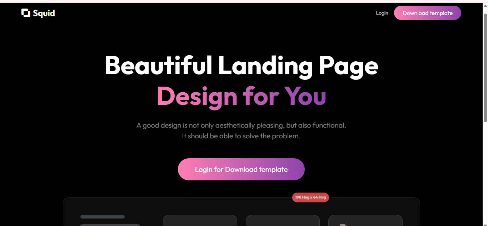
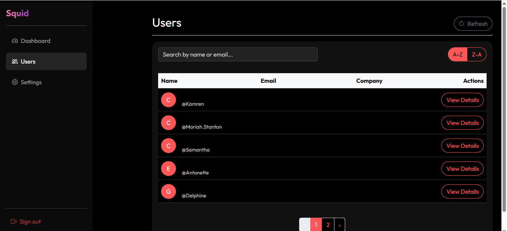

# Squid Figma - SaaS Landing + Dashboard Assignment

This project is a React-based SaaS application featuring a public landing page, authentication system, and a protected dashboard with user management and settings.

## Features

### General
-   Built with **React (Vite)** and **Bootstrap 5**.
-   **Responsive** design for mobile and desktop.
-   **Clean code** structure with reusable components.

### Pages
1.  **Landing Page**:
    -   Pixel-perfect replication of the provided Figma design (conceptually).
    -   Hero, Features, CTA, and Footer sections.
    -   Fully responsive navbar.

2.  **Authentication**:
    -   Fake login mechanism using `AuthContext`.
    -   Credentials stored in `localStorage` for persistence.
    -   Protected routes redirect unauthenticated users to `/login`.

3.  **Dashboard**:
    -   Summary cards showing key statistics.
    -   Sidebar navigation.

4.  **Users Page**:
    -   Fetches data from [JSONPlaceholder](https://jsonplaceholder.typicode.com/users).
    -   **Search** by name or email.
    -   **Sort** alphabetically (A-Z, Z-A).
    -   **Pagination** (5 users per page).
    -   **Details Modal** for viewing user information.
    -   Loading, Error, and Empty states handled.

5.  **Settings Page**:
    -   Profile settings form.
    -   **Dark/Light Theme Toggle** (persisted in `localStorage`).

## 🖼 Screenshots

### 🏠 Landing Page


### 📊 Dashboard


## Setup Instructions

1.  **Install Dependencies**:
    ```bash
    npm install
    ```

2.  **Run Development Server**:
    ```bash
    npm run dev
    ```

3.  **Build for Production**:
    ```bash
    npm run build
    ```

## Technologies Used
-   React
-   Vite
-   Bootstrap 5 & React-Bootstrap
-   React Router DOM v6
-   Sass

## Project Structure
```
src/
 ├─ components/
 │   ├─ ui/           # Reusable atomic components
 │   ├─ layout/       # Navbar, Sidebar, Layouts
 ├─ pages/            # Page components
 ├─ context/          # Auth Context
 ├─ styles/           # SCSS styles & overrides
 ├─ App.jsx           # Main App & Routing
 └─ main.jsx          # Entry point
```
